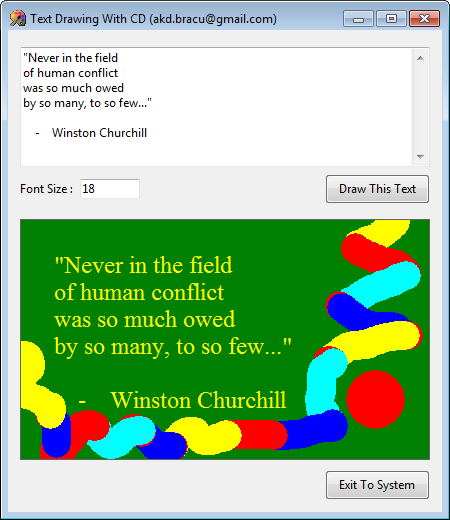

<h1>
Text Drawing on Graphic Canvas with CD Library
</h1>

The famous <b>OpenGL</b> graphics libary lacks the API for drawing text on canvas. Then how can we draw text?? A solution to this problem would be to use the <b>Canvas Draw (CD)</b> library, which can draw text as well as general-purpose graphic primitives and has very similar API as OpenGL.

Internally CD uses <b>FreeType</b>, an open-source efficient font rendering engine.

This is a simple demonstration of how to draw ASCII Text with other graphic elements on the graphic canvas using CD.

<h3>Download</h3>
<ul>
<li>
<a href="https://github.com/AKD92/Text-Drawing-in-Graphic-Canvas-with-CD/raw/master/bin/iup_cd_text_draw_demo.exe">Binary Executable (win32)
 </a> Compiled using <a href="http://tdm-gcc.tdragon.net/about">TDM-GCC 5.1</a>
</li>
</ul>

<h3>Related Links</h3>
<ul>
<li>
<a href="http://webserver2.tecgraf.puc-rio.br/ftp_pub/lfm/cd.pdf">Overview of CD</a>
</li>
<li>
<a href="https://webserver2.tecgraf.puc-rio.br/cd/">Canvas Draw (CD) Home Page</a>
</li>
<li>
<a href="https://www.freetype.org/">The FreeType Project</a>
</li>
</ul>
